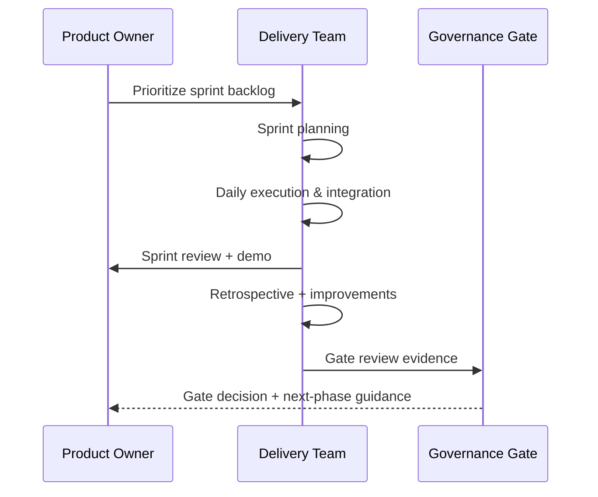

# Sprint-in-phase delivery flow (Scrum cadence + gate review)

Sprint execution happens inside governance phases, with gate reviews validating readiness to advance.

## Cadence alignment

- **Sprint planning** aligns with phase objectives set during governance gates.
- **Sprint review** provides the evidence required for gate readiness checks.
- **Retrospectives** feed continuous improvements into the next sprint.

## Related documentation

- Governance lifecycle and gates: [Hybrid lifecycle](../governance/lifecycle.md)
