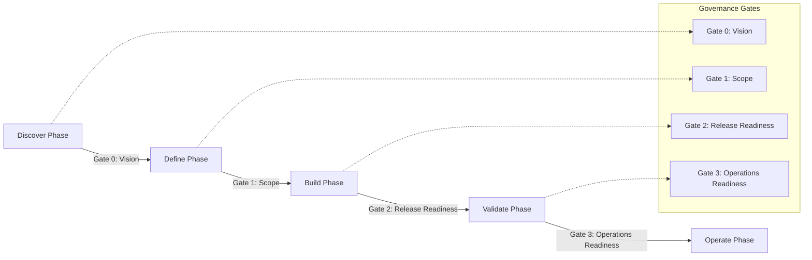

# Hybrid lifecycle (phases + gates)

The delivery lifecycle blends iterative execution with formal gate reviews. Each phase can host multiple sprints, but a gate review determines readiness to proceed.

## Gate criteria checklist

- **Gate 0: Vision**: problem statement, stakeholder alignment, and funding authorization.
- **Gate 1: Scope**: roadmap, risk register, and dependency validation.
- **Gate 2: Release Readiness**: feature completion, security validation, and compliance sign-off.
- **Gate 3: Operations Readiness**: runbooks, monitoring, and support readiness.

## Related flow

The Scrum cadence inside each phase is documented in [Sprint-in-phase delivery flow](../agile/sprint-flow.md).
